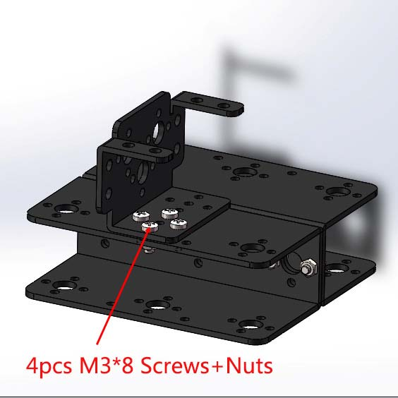
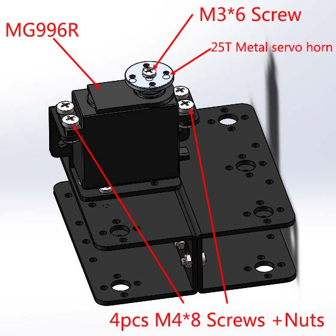
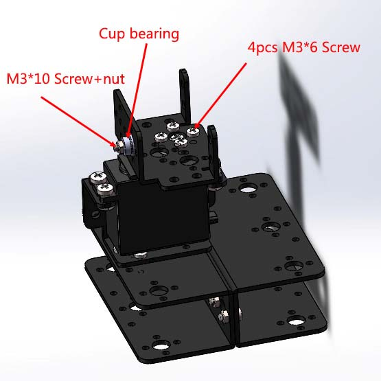
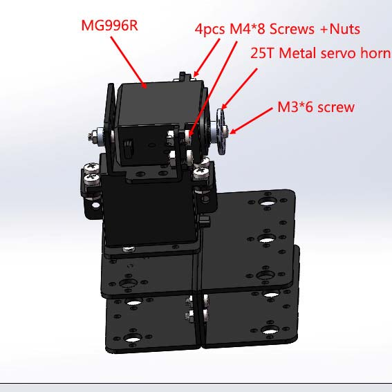

## Piezas del soporte

Listado de piezas para en asssemby interno de los servomotores conectados a la cámara, a falta de adaptación por escalado al tamaño de los servos pequeños.
El listado de piezas adjuntas es el siguiente:

1. Soporte largo servomotor
2. Soporte multifuncional
3. Soporte L
4. Soporte tapa
5. Soporte abrazadera

## Fuente de montaje

Respecto al montaje y adaptación de los servos, podría aplicarse la misma mecánica que en los brazos robóticos en los 2 gdl de la base tal que:

Figura 1. Paso 1

Figura 2. Paso 2

Figura 3. Paso 3

Figura 4. Paso 4
